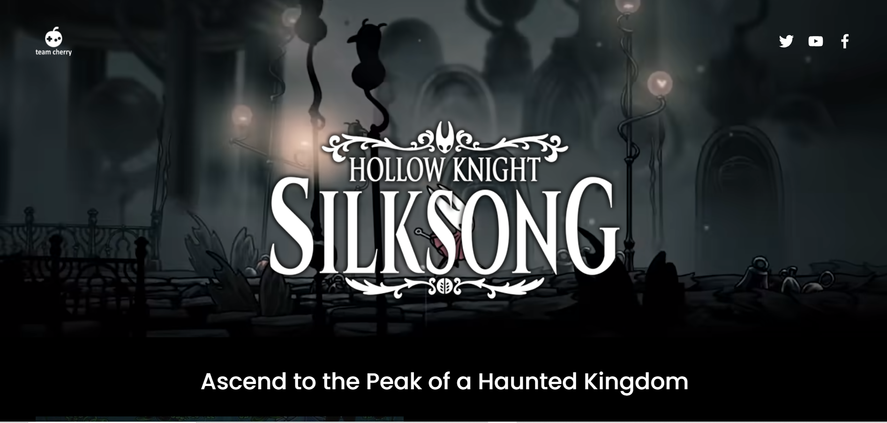

Hello World
<div align="center">
  
  <h2 align="center">Hollow Knight: Silksong </h2>

  Hollow Knight: Silksong is a responsive game-themed website <br />It is responsive in all devices, it was build using HTML, CSS, and JavaScript.

  <a href="https://samxzhk.github.io/hollow-knight-website/"><strong>➥ Live Demo</strong></a>

</div>

<br />

### Screeshots



### Prerequisites

Before you begin, ensure you have met the following requirements:

* [Git](https://git-scm.com/downloads "Download Git") must be installed on your operating system.

### Run Locally

To run the app locally, run this command on your git bash:

Linux and macOS:

```bash
sudo git clone https://github.com/samxzhk/hollow-knight-website.git
```

Windows:

```bash
git clone https://github.com/samxzhk/hollow-knight-website.git
```

### Contact

If you want to contact with me you can reach me at [Twitter](https://www.twitter.com/sammdevjs) or at [Linkedin](https://www.linkedin.com/in/samia-cunha)
